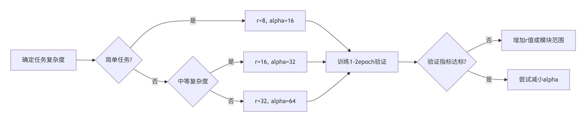

# LoRA参数设置对模型训练的影响分析

## 📊 核心参数影响矩阵

| 参数          | 低值设置影响    | 高值设置影响    | 推荐起始值 | 典型范围     |
|-------------|-----------|-----------|-------|----------|
| **r(秩)**    | 训练快但可能欠拟合 | 表达强但资源消耗大 | 8     | 4-64     |
| **alpha**   | 适配器影响温和   | 覆盖更多原始知识  | 2×r   | r-4×r    |
| **dropout** | 容易过拟合     | 可能欠拟合     | 0.1   | 0.05-0.3 |

## 🔍 参数详解与实验建议

### 1. 秩(r) - 控制模型容量

```python
# 不同r值对比实验
r_values = [4, 8, 16, 32]
```

- **训练曲线特征**：
    - r=4：快速收敛但验证集指标早滞
        - 秩小：训练速度快，但可能欠拟合原始知识。
    - r=32：需要更多epoch但最终指标更优
        - 秩大：表达能力强，但资源消耗大。
- **建议**：
    - 开始时，选择较小的秩值，如4或8，观察训练速度和性能。
    - 逐渐增加秩值，观察性能提升。
    - 选择一个平衡点，既能表达原始知识又不占用过多资源。

### 2. alpha - 控制适配强度

```python
# alpha/r比例实验
ratios = [1, 2, 4]  # 对应alpha=r,2r,4r
```

- **训练曲线特征**：
    - alpha=1r：覆盖范围小但训练快（训练loss下降平缓）
        - 适配器影响小：训练速度快，但可能欠拟合原始知识。
    - alpha=4r：覆盖范围大但训练慢（初期loss下降快但后期可能震荡）
        - 适配器影响大：表达能力强，但训练时间长。

### 3. dropout - 正则化控制

```python
# dropout消融实验
dropouts = [0, 0.1, 0.3]    # 0为无dropout，0.1和0.3为实验值
```

- **训练曲线特征**：
    - dropout=0.1：训练速度快但可能过拟合
        - 正则化弱：训练速度快，但可能过拟合。
    - dropout=0.3：训练速度慢但性能更优
  - 过拟合判断
    - 训练acc >> 验证acc → 增加dropout
    - 两者接近但指标低 → 减少dropout

### 4.参数组合策略
#### 资源受限场景 (8GB显存)
```
LoraConfig(
    r=8,
    lora_alpha=16,
    lora_dropout=0.2,
    target_modules=["q_proj","v_proj"]
)
```
#### 平衡配置 (16-24GB显存)
```
LoraConfig(
    r=16,
    lora_alpha=32,
    lora_dropout=0.1,
    target_modules=["q_proj","k_proj","v_proj","o_proj"]
)
```  
#### 高性能配置 (40GB+显存)
```
LoraConfig(
    r=32,
    lora_alpha=64,
    lora_dropout=0.05,
    target_modules=["q_proj","k_proj","v_proj","o_proj","gate_proj","up_proj"]
)
``` 
### 📈 调优路线图



### 6. 实验建议
- **初始设置**：
    - 选择秩值r=8，alpha=2r=16，dropout=0.1。
    - 观察初始训练曲线，选择一个合适的平衡点。
- **调整策略**：
    - 秩值r：逐渐增加或减少，观察性能变化。
    - alpha：根据需要调整，观察覆盖范围变化。
    - dropout：根据需要调整，观察正则化效果。
- **监控与调整**：
    - 监控验证集性能，选择一个性能最佳的组合。
    - 考虑资源消耗，选择一个在性能和资源之间的平衡点。
    - 定期调整参数，观察性能变化。

